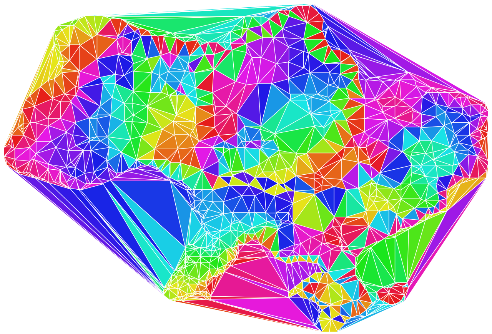

# delaunator [](https://travis-ci.org/mapbox/delaunator) [](https://github.com/mourner/projects)

A really fast JavaScript library for
[Delaunay triangulation](https://en.wikipedia.org/wiki/Delaunay_triangulation) of 2D points.

- [Interactive Demo](https://mapbox.github.io/delaunator/demo.html)
- [Guide to data structures](https://mapbox.github.io/delaunator/)

Projects based on Delaunator:

- [d3-delaunay](https://github.com/d3/d3-delaunay) for Voronoi diagrams, search, traversal and rendering.
- [d3-geo-voronoi](https://github.com/Fil/d3-geo-voronoi) for Delaunay triangulations and Voronoi diagrams on a sphere (e.g. for geographic locations).
- [fogleman/delaunay](https://github.com/fogleman/delaunay) is a port of Delaunator to Go.



## Example

```js
const points = [[168, 180], [168, 178], [168, 179], [168, 181], [168, 183], ...];

const delaunay = Delaunator.from(points);
console.log(delaunay.triangles);
// [623, 636, 619,  636, 444, 619, ...]
```

## Install

Install with NPM (`npm install delaunator`) or Yarn (`yarn add delaunator`), then:

```js
// import as an ES module
import Delaunator from 'delaunator';

// or require in Node / Browserify
const Delaunator = require('delaunator');
```

Or use a browser build directly:

```html
<script src="https://unpkg.com/delaunator@2.0.3/delaunator.min.js"></script> <!-- minified build -->
<script src="https://unpkg.com/delaunator@2.0.3/delaunator.js"></script> <!-- dev build -->
```

## API Reference

#### Delaunator.from(points[, getX, getY])

Constructs a delaunay triangulation object given an array of points (`[x, y]` by default).
`getX` and `getY` are optional functions of the form `(point) => value` for custom point formats.
Duplicate points are skipped.

#### new Delaunator(coords)

Constructs a delaunay triangulation object given a **typed array** of point coordinates of the form:
`[x0, y0, x1, y1, ...]`.

#### delaunay.triangles

A flat `Int32Array` array of triangle vertex indices (each group of three numbers forms a triangle).
All triangles are directed counterclockwise.

To get the coordinates of all triangles, use:

```js
for (let i = 0; i < triangles.length; i += 3) {
    coordinates.push([
        points[triangles[i]],
        points[triangles[i + 1]],
        points[triangles[i + 2]]
    ]);
}
```

#### delaunay.halfedges

A flat `Int32Array` array of triangle half-edge indices that allows you to traverse the triangulation.
`i`-th half-edge in the array corresponds to vertex `triangles[i]` the half-edge is coming from.
`halfedges[i]` is the index of a twin half-edge in an adjacent triangle
(or `-1` for outer half-edges on the convex hull).

The flat array-based data structures might be counterintuitive,
but they're one of the key reasons this library is fast.

## Performance

Benchmark results against other Delaunay JS libraries
(`npm run bench` on Macbook Pro Retina 15" 2017, Node v10.9.0):

&nbsp; | uniform 100k | uniform 1&nbsp;million | gauss 100k | gauss 1&nbsp;million | grid 100k | grid 1&nbsp;million | degen 100k | degen 1&nbsp;million
:-- | --: | --: | --: | --: | --: | --: | --: | --:
**delaunator** | 97ms | 1.28s | 70ms | 1s | 81ms | 988ms | 48ms | 917ms
[faster&#8209;delaunay](https://github.com/Bathlamos/delaunay-triangulation) | 473ms | 4.27s | 411ms | 4.62s | 272ms | 4.3s | 68ms | 810ms
[incremental&#8209;delaunay](https://github.com/mikolalysenko/incremental-delaunay) | 547ms | 5.9s | 505ms | 6.08s | 172ms | 2.11s | 528ms | 6.09s
[d3&#8209;voronoi](https://github.com/d3/d3-voronoi) | 972ms | 15.04s | 909ms | 13.86s | 358ms | 5.55s | 720ms | 11.13s
[delaunay&#8209;fast](https://github.com/ironwallaby/delaunay) | 3.8s | 132s | 4s | 138s | 12.57s | 399s | timeout | timeout
[delaunay](https://github.com/darkskyapp/delaunay) | 4.85s | 156s | 5.73s | 178s | 15.05s | 326s | timeout | timeout
[delaunay&#8209;triangulate](https://github.com/mikolalysenko/delaunay-triangulate) | 2.24s | OOM | 2.04s | OOM | OOM | OOM | 1.51s | OOM
[cdt2d](https://github.com/mikolalysenko/cdt2d) | 45s | timeout | 51s | timeout | 118s | timeout | 17s | timeout

## Papers

The algorithm is based on ideas from the following papers:

- [A simple sweep-line Delaunay triangulation algorithm](http://www.academicpub.org/jao/paperInfo.aspx?paperid=15630), 2013, Liu Yonghe, Feng Jinming and Shao Yuehong
- [S-hull: a fast radial sweep-hull routine for Delaunay triangulation](http://www.s-hull.org/paper/s_hull.pdf), 2010, David Sinclair
- [A faster circle-sweep Delaunay triangulation algorithm](http://cglab.ca/~biniaz/papers/Sweep%20Circle.pdf), 2011, Ahmad Biniaz and Gholamhossein Dastghaibyfard
